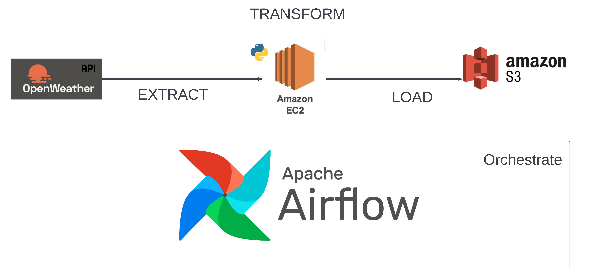
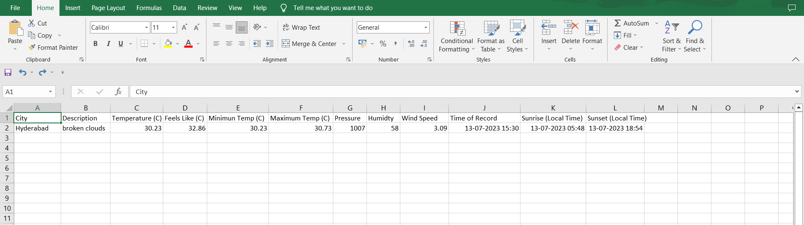

# OpenWeather ETL Pipeline using Airflow

## Project Description:

Developed an ELT (Extract, Load, Transform) pipeline leveraging the OpenWeather API, Airflow, Python, EC2, and S3. The pipeline extracts weather data from the OpenWeather API, performs data transformation using Python scripts running on an EC2 instance, and loads the transformed data into S3 for further analysis.

## Architecture 

## Key Achievements:

- Designed and implemented an automated data extraction process from the OpenWeather API.
- Orchestrated the pipeline using Airflow to ensure efficient scheduling and execution of data transformations.
- Leveraged Python scripts to perform data transformation tasks, including converting temperature units, extracting relevant weather attributes, and formatting the 
  data for analysis.
- Configured an EC2 instance to execute the Python transformation scripts and optimized the environment for efficient data processing.
- Successfully loaded the transformed weather data into an S3 bucket, ensuring data integrity and security.

## Technologies Used:

OpenWeather API, Airflow, Python, EC2, S3

This project showcases my proficiency in data integration, ETL processes, and cloud-based data storage. It demonstrates my ability to effectively leverage APIs, orchestration tools, and scripting languages to build robust and scalable data pipelines.

## The Data we get on each API call

{"coord":{"lon":78.4744,"lat":17.3753},"weather":[{"id":803,"main":"Clouds","description":"broken clouds","icon":"04d"}],"base":"stations","main":{"temp":303.38,"feels_like":306.01,"temp_min":303.38,"temp_max":303.88,"pressure":1007,"humidity":58},"visibility":6000,"wind":{"speed":3.09,"deg":260},"clouds":{"all":75},"dt":1689242386,"sys":{"type":1,"id":9214,"country":"IN","sunrise":1689207532,"sunset":1689254655},"timezone":19800,"id":1269843,"name":"Hyderabad","cod":200}

## The Transformed data that is in each ".csv" file in S3 bucket looks like

## The Transformation performed on the data

1. The data is extracted from an HTTP API using the SimpleHttpOperator in the task extract_weather_data.

2. The extracted data is transformed in the transform_load_data function using various operations:

     - The temperature values are converted from Kelvin to Celsius using the kelvin_to_celsius function.
     - Specific data fields are extracted from the extracted JSON data, such as city name, weather description, temperature, feels like temperature, minimum 
       temperature, maximum temperature, pressure, humidity, wind speed, time of record, sunrise time, and sunset time.                                            
     - The timestamps in the extracted data, such as time_of_record, sunrise_time, and sunset_time, are converted from UNIX timestamps to datetime objects in UTC 
       timezone using the datetime.utcfromtimestamp() function. The time zone offset from the data is added to adjust the time to the correct local time.  
     - The transformed data is stored in a dictionary format.

3. The transformed data is converted into a pandas DataFrame using pd.DataFrame.
4. The transformed data is saved as a CSV file in an S3 bucket. The file name includes the current timestamp.

